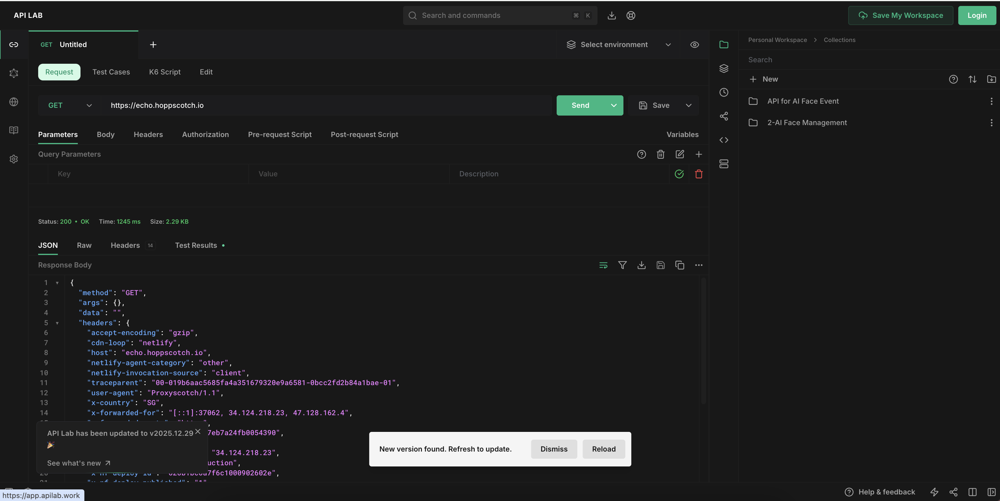

  
  <h3>
    <b>
      API Lab
    </b>
  </h3>
  <b>
    Internal Source Based on Hoppscotch - API Dog
  </b>
  

 

  

  

    
      Built with ❤︎ by
      <a href="https://github.com/luongquochai/apilab/graphs/contributors">
        contributors
      </a>
    
  

   
  

    <a href="https://app.apilab.work">
      <picture>
        <source media="(prefers-color-scheme: dark)" srcset="./assets/banner/banner-dark.png">
        <source media="(prefers-color-scheme: light)" srcset="./assets/banner/banner-light.png">
        
      </picture>
    </a>
  

_We highly recommend you take a look at the [**API Lab Documentation**](https://docs.apilab.work) to learn more about the app._

#### **Support**

### **Features**

❤️ **Lightweight:** Crafted with minimalistic UI design.

⚡️ **Fast:** Send requests and get responses in real time.

֎ **AI Integrations:**

1. API testing:

- Generate body request
- Generate pre-request script
- Generate post-request script

2. Generate Test cases:

- Support generate test cases for API testing with options modal or prompt
  

3. Generate K6 Script:

- Support generate k6 script for API testing with options modal or prompt
  

4. Integrate with [Scalar](https://scalar.com/#api-docs)

- Support modern render OpenAPI/Swagger documents and publish docs with self-host.
  

🗄️ **HTTP Methods:** Request methods define the type of action you are requesting to be performed.

- `GET` - Requests retrieve resource information
- `POST` - The server creates a new entry in a database
- `PUT` - Updates an existing resource
- `PATCH` - Very similar to `PUT` but makes a partial update on a resource
- `DELETE` - Deletes resource or related component
- `HEAD` - Retrieve response headers identical to those of a GET request, but without the response body.
- `CONNECT` - Establishes a tunnel to the server identified by the target resource
- `OPTIONS` - Describe the communication options for the target resource
- `TRACE` - Performs a message loop-back test along the path to the target resource
- `<custom>` - Some APIs use custom request methods such as `LIST`. Type in your custom methods.

🌈 **Theming:** Customizable combinations for background, foreground, and accent colors — [customize now](https://hoppscotch.io/settings).

- Choose a theme: System preference, Light, Dark, and Black
- Choose accent colors: Green, Teal, Blue, Indigo, Purple, Yellow, Orange, Red, and Pink
- Distraction-free Zen mode

_Customized themes are synced with your cloud/local session._

🔥 **PWA:** Install as a [Progressive Web App](https://web.dev/progressive-web-apps) on your device.

- Instant loading with Service Workers
- Offline support
- Low RAM/memory and CPU usage

🚀 **Request:** Retrieve response from endpoint instantly.

1. Choose `method`
2. Enter `URL`
3. Send

- Copy/share public "Share URL"
- Generate/copy request code snippets for 10+ languages and frameworks
- Import `cURL`
- Label requests

🔌 **WebSocket:** Establish full-duplex communication channels over a single TCP connection.

📡 **Server-Sent Events:** Receive a stream of updates from a server over an HTTP connection without resorting to polling.

🌩 **Socket.IO:** Send and Receive data with the SocketIO server.

🦟 **MQTT:** Subscribe and Publish to topics of an MQTT Broker.

🔮 **GraphQL:** GraphQL is a query language for APIs and a runtime for fulfilling those queries with your existing data.

- Set endpoint and get schema
- Multi-column docs
- Set custom request headers
- Query schema
- Get query response

🔐 **Authorization:** Allows to identify the end-user.

- None
- Basic
- Bearer Token
- OAuth 2.0
- OIDC Access Token/PKCE

📢 **Headers:** Describes the format the body of your request is being sent in.

📫 **Parameters:** Use request parameters to set varying parts in simulated requests.

📃 **Request Body:** Used to send and receive data via the REST API.

- Set `Content Type`
- FormData, JSON, and many more
- Toggle between key-value and RAW input parameter list

📮 **Response:** Contains the status line, headers, and the message/response body.

- Copy the response to the clipboard
- Download the response as a file
- View response headers
- View raw and preview HTML, image, JSON, and XML responses

⏰ **History:** Request entries are synced with your cloud/local session storage.

📁 **Collections:** Keep your API requests organized with collections and folders. Reuse them with a single click.

- Unlimited collections, folders, and requests
- Nested folders
- Export and import as a file or GitHub gist

_Collections are synced with your cloud/local session storage._

📜 **Pre-Request Scripts:** Snippets of code associated with a request that is executed before the request is sent.

- Set environment variables
- Include timestamp in the request headers
- Send a random alphanumeric string in the URL parameters
- Any JavaScript functions

👨‍👩‍👧‍👦 **Teams:** Helps you collaborate across your teams to design, develop, and test APIs faster.

- Create unlimited teams
- Create unlimited shared collections
- Create unlimited team members
- Role-based access control
- Cloud sync
- Multiple devices

👥 **Workspaces:** Organize your personal and team collections environments into workspaces. Easily switch between workspaces to manage multiple projects.

- Create unlimited workspaces
- Switch between personal and team workspaces

⌨️ **Keyboard Shortcuts:** Optimized for efficiency.

> **[Read our documentation on Keyboard Shortcuts](https://docs.apilab.work/documentation/features/shortcuts)**

🌐 **Proxy:** Enable Proxy Mode from Settings to access blocked APIs.

- Hide your IP address
- Fixes [`CORS`](https://developer.mozilla.org/en-US/docs/Web/HTTP/CORS) (Cross-Origin Resource Sharing) issues
- Access APIs served in non-HTTPS (`http://`) endpoints
- Use your Proxy URL

_Official proxy server is hosted by API Lab Proxy - **[GitHub](https://github.com/apilab/proxy)** - **[Privacy Policy](https://docs.apilab.work/support/privacy)**._

🌎 **i18n:** Experience the app in your language.

Help us to translate API Lab. Please read [`TRANSLATIONS`](TRANSLATIONS.md) for details on our [`CODE OF CONDUCT`](CODE_OF_CONDUCT.md) and the process for submitting pull requests to us.

☁️ **Auth + Sync:** Sign in and sync your data in real-time across all your devices.

**Sign in with:**

- GitHub
- Google
- Email
- SSO (Single Sign-On)[^EE]

**🔄 Synchronize your data:** Handoff to continue tasks on your other devices.

- Workspaces
- History
- Collections
- Environments
- Settings

✅ **Post-Request Tests:** Write tests associated with a request that is executed after the request's response.

- Check the status code as an integer
- Filter response headers
- Parse the response data
- Set environment variables
- Write JavaScript code

🌱 **Environments:** Environment variables allow you to store and reuse values in your requests and scripts.

- Unlimited environments and variables
- Initialize through the pre-request script
- Export as / import from GitHub gist

  
<i>Use-cases</i>

---

- By storing a value in a variable, you can reference it throughout your request section
- If you need to update the value, you only have to change it in one place
- Using variables increases your ability to work efficiently and minimizes the likelihood of error

---

🚚 **Bulk Edit:** Edit key-value pairs in bulk.

- Entries are separated by newline
- Keys and values are separated by `:`
- Prepend `#` to any row you want to add but keep disabled

🎛️ **Admin dashboard:** Manage your team and invite members.

- Insights
- Manage users
- Manage teams

## **Demo**

- Web : [app.apilab.work](https://app.apilab.work)
- Home: [apilab.work](https://apilab.work)
- Docs: [docs.apilab.work](https://docs.apilab.work)

## Usage

1. Provide your API endpoint in the URL field
2. Click "Send" to simulate the request
3. View the response

## Contributing

Please contact me via gmail [apilab.tech@gmail.com](mailto:apilab.tech@gmail.com) if you want to contribute to this project.

## Authors

This project owes its existence to the collective efforts of all those who contribute.

  

## License

This project is licensed under the [MIT License](https://opensource.org/licenses/MIT) — see the [`LICENSE`](LICENSE) file for details.

[^EE]: Enterprise edition feature. [Learn more](https://docs.apilab.work/documentation/self-host/getting-started).
